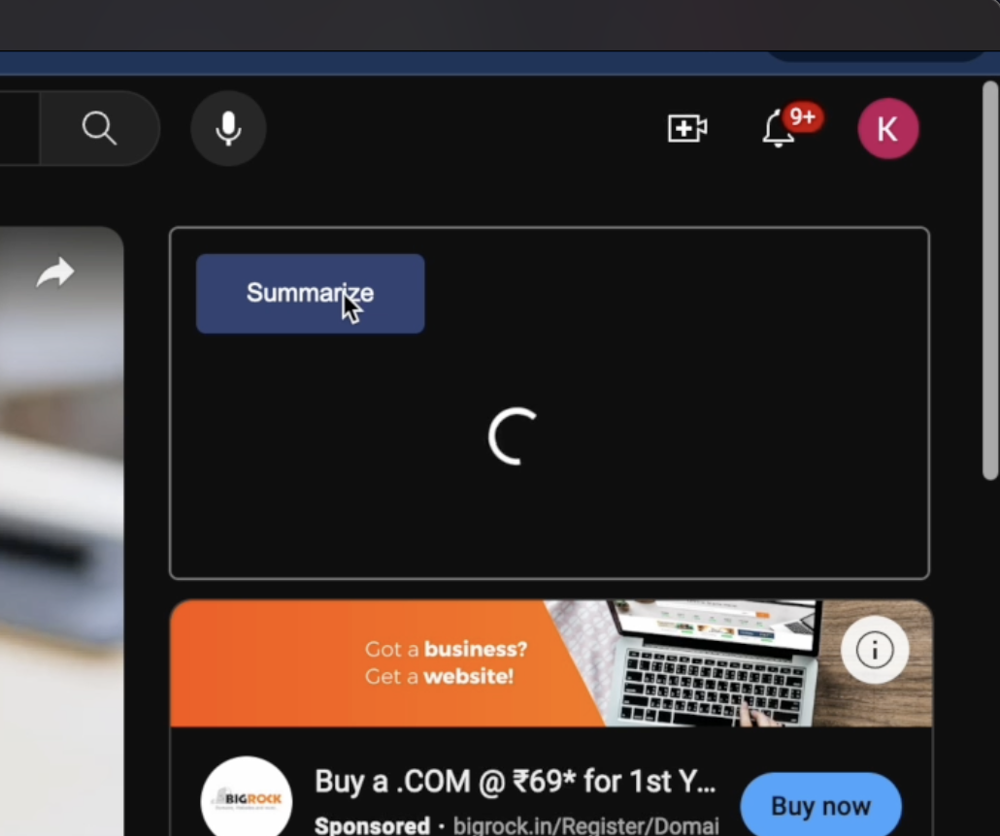
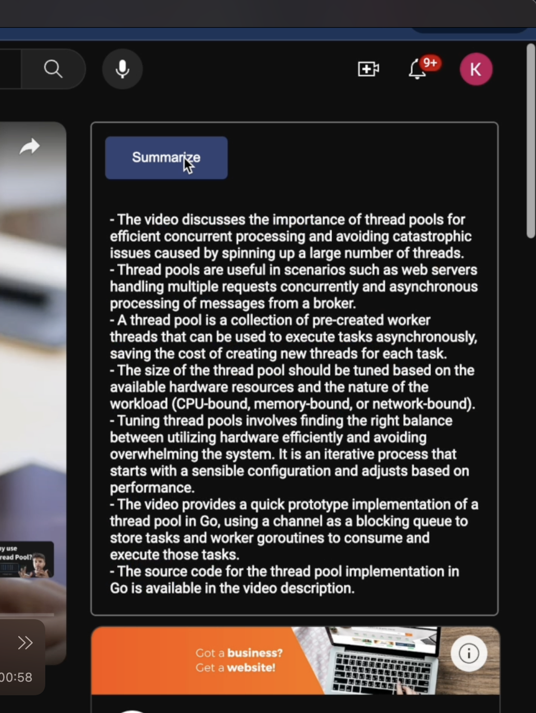
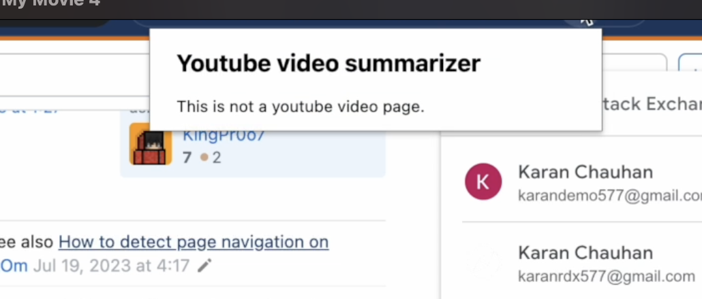
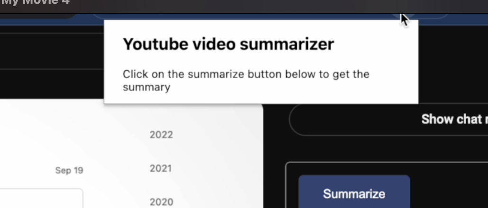

This is a youtube video summarizer chrome extension. It is build using HTML, CSS, Javascript having manifest version 3. 

#### Time Taken - 1 Week
#### Model used - Claude 3

You can find the backend repository [here](https://github.com/karanch577/yt-summarizer-backend)

#### Features
- Summarize the whole youtube video with on button click
- Popup window show the message whether you are on a youtube video page or not
- Reset the summary when navigated from one video to another

#### Screenshots

